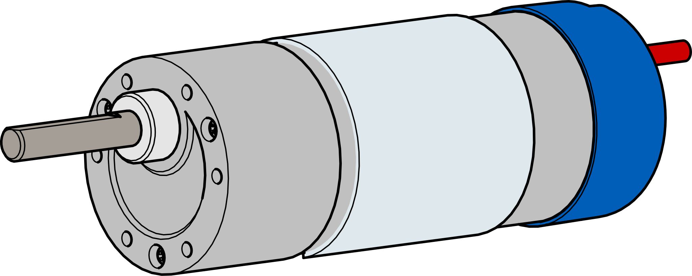

Maverick DC Motor
=================

The Maverick is a 12VDC spur gear motor that features a built-in encoder and a 6mm D-Shaft output shaft. 

|

.. dropdown:: Motor Specifications (Click to Open)
    :animate: fade-in
    :color: info

    .. list-table:: Mechanical Specs
        :widths: 30 10 10 10
        :header-rows: 1
        :align: center

        * - Function
          - Min
          - Nom
          - Max
        * - Input Voltage
          - ---
          - 12VDC
          - ---
        * - Gear Ratio
          - ---
          - 1:61
          - ---
        * - No Load RPM
          - 88
          - 100
          - 112
        * - No Load Current
          - ---
          - 600mA
          - ---
        * - Rated Speed
          - 68
          - 80
          - 92
        * - Rated Current
          - ---
          - ---
          - 2.2A
        * - Rated Torque
          - ---
          - 139oz-in
          - ---
        * - Stall Current
          - ---
          - ---
          - 11A
        * - Stall Torque
          - 708oz-in
          - ---
          - ---
        * - Direction
          - ---
          - CW
          - ---
        * - Encoder Voltage
          - 4
          - ---
          - 5
        * - Encoder Current
          - ---
          - 6mA 
          - ---
        * - Encoder CPR
          - ---
          - 6
          - ---

    .. note:: With a CPR of ``6`` and a gear ratio of ``1:61`` the encoder counts per revolution on the output shaft will be :math:`\begin{equation}6*61*4 = 1464\end{equation}`

