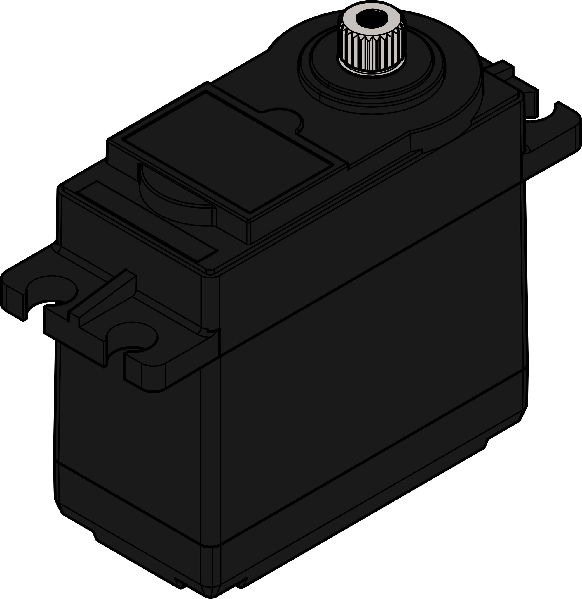

Servo Motors
============

There are two multi-mode standard sized servos available from Studica, a torque and a fast version. Each servo allows for continuous and standard movement of the servo motor. In continuous mode, the servo will spin proportionally based on the input in the CW or CCW direction. In standard mode, the servo will act as a regular servo and have a range of motion of 300°. That is 150° CW and 150° CCW.

|

.. dropdown:: Servo Specifications (Click to Open)
    :animate: fade-in
    :color: info

    .. list-table:: Mechanical Specs
        :widths: 30 30 30
        :header-rows: 1
        :align: center

        * - Function
          - `Torque Part# 75002 <https://www.studica.co/multi-mode-smart-servo>`__
          - `Fast Part# 75007 <https://www.studica.co/multi-mode-smart-servo-200>`__
        * - Size
          - 40mm x 20.1mm x 38.3mm x 54mm
          - 40mm x 20.1mm x 38.3mm x 54mm
        * - Weight
          - 64g
          - 65g
        * - Gear Type
          - Steel 
          - Steel
        * - Bearing
          - Dual Ball Bearings
          - Dual Ball Bearings
        * - Spline
          - 25T
          - 25T
        * - Case
          - Nylon & Fiberglass
          - Nylon & Fiberglass
        * - Connector Wire
          - 750mm ± 5mm (White, Red, Black)
          - 750mm ± 5mm (White, Red, Black)
        * - Motor
          - Metal Brush Motor
          - Metal Brush Motor
        * - Water Resistance
          - No
          - No 

    .. list-table:: Electrical Specs
        :widths: 30 20 20 20 20
        :header-rows: 1
        :align: center

        * - Function
          - Torque @ 4.8V
          - Torque @ 6.0V
          - Fast @ 4.8V
          - Fast @ 6.0V
        * - Idle Current
          - 5mA
          - 7mA
          - 5mA
          - 7mA
        * - No Load Speed
          - 0.25sec/60°(40 RPM)
          - 0.2sec/60° (50 RPM)
          - 0.057sec/60° (175 RPM)
          - 0.046sec/60° (217RPM)
        * - Running Current
          - 130mA
          - 150mA
          - 120mA
          - 130mA
        * - Stall Torque
          - 180.85oz-in 
          - 300oz-in 
          - 47.2oz-in
          - 69.5oz-in
        * - Stall Current
          - 1500mA
          - 1800mA
          - 2200mA
          - 2700mA

    .. list-table:: Control Specs
        :widths: 30 30
        :header-rows: 1
        :align: center

        * - Function
          - Spec
        * - Command Signal
          - Pulse Width Modulation
        * - Amplifier Type
          - Digital Comparator
        * - Pulse Width Range
          - 500μS ~ 2500μS
        * - Neutral Position
          - 1500μS
        * - Range of Motion 
          - 300° ± 5°
        * - Dead band width 
          - 4μS
        * - Rotating Direction
          - CW

    .. list-table:: Enviromental Conditions
        :widths: 30 30
        :header-rows: 1
        :align: center

        * - Function
          - Range
        * - Storage Temperature
          - -30°C ~ 80°C
        * - Operating Temperature
          - -15°C ~ 70°C

    .. list-table:: Standard Enviroment
        :widths: 30 30
        :header-rows: 1
        :align: center

        * - Function
          - Range
        * - Temperature
          - 25°C ± 5°C
        * - Humidity
          - 65% ± 10%

.. dropdown:: Switching Servo Modes
    :animate: fade-in
    :color: info

    With the servos able to move in continuous or standard movements. The servo requires a way to know which mode it is in. The Servo Smart Programmer accomplishes this task. 

    **Setting the Servo to Standard Mode**

    - Connect the battery and servo to the programmer
    - Set the selection switch to S on the top left of the programmer
    - On the battery pack turn on the power
    - Press the :bdg-danger-line:`P` button for 5 seconds (All LEDs will flash when ready to let go)

    **Testing Standard Mode**

    - Connect the battery and servo to the programmer
    - Set the selection switch to S on the top left of the programmer
    - On the battery pack turn on the power
    - Press the :bdg-danger-line:`S` button to set the servo to sweep mode 
    - The Servo will now turn from -150° to 150°
    - Press the :bdg-danger-line:`S` button for a second time to enter manual mode
    - Pressing the :bdg-danger-line:`L` button will move the servo to -150°
    - Pressing the :bdg-danger-line:`P` button will move the servo to 0°
    - Pressing the :bdg-danger-line:`R` button will move the servo to 150°
    - Pressing the :bdg-danger-line:`S` button will turn the programmer off

    .. important:: Remember to turn off the battery pack by sliding the power switch to :bdg-danger-line:`off`

    **Setting the Servo to Continuous Mode**

    - Connect the battery and servo to the programmer
    - Set the selection switch to C on the top left of the programmer
    - On the battery pack turn on the power
    - Press the :bdg-danger-line:`P` button for 5 seconds (All LEDs will flash when ready to let go)

    **Testing Continuous Mode**

    - Connect the battery and servo to the programmer
    - Set the selection switch to C on the top left of the programmer
    - On the battery pack turn on the power
    - Press the :bdg-danger-line:`S` button to set the servo to sweep mode 
    - The Servo will now constantly turn between 360° CW and 360° CCW
    - Press the :bdg-danger-line:`S` button for a second time to enter manual mode
    - Pressing the :bdg-danger-line:`L` button will move the servo in CW direction at full speed
    - Pressing the :bdg-danger-line:`P` button will stop the servo
    - Pressing the :bdg-danger-line:`R` button will move the servo in CCW direction at full speed
    - Pressing the :bdg-danger-line:`S` button will turn the programmer off

    .. important:: Remember to turn off the battery pack by sliding the power switch to :bdg-danger-line:`off`

Programming
-----------

Standard Servo
^^^^^^^^^^^^^^

.. tabs::

    .. tab:: Java

        .. code-block:: java
            :linenos:

            //import the Servo Library
            import com.studica.frc.Servo;

            //Create the Servo Object
            private Servo servo;

            //Constuct a new instance
            servo = new Servo(port);

            //Can then use this mutator to set the servo angle
            servo.setAngle(degrees); //Range 0° - 300°
    
        The mutator method will allow you to set the angle of the servo

    .. tab:: C++

        .. code-block:: c++
            :linenos:

            //Include the Servo Library
            #include "studica/Servo.h"

            //Constructor
            studica::Servo servo{port};

            //Use this function to set the servo angle
            servo.SetAngle(degrees); //Range 0° - 300°

        The function will allow you to set the angle of the servo

Continuous Servo
^^^^^^^^^^^^^^^^

.. tabs::
   
    .. tab:: Java

        .. code-block:: java
            :linenos:

            //import the Servo Continuous Library
            import com.studica.frc.ServoContinous;

            //Create the Servo Continuous Object
            private ServoContinous servo;

            //Constuct a new instance
            servo = new ServoContinuous(port);

            //Can then use this mutator to set the servo speed
            servo.set(speed); //Range -1 - 1 (0 Stop)
    
        The mutator method will allow you to set the speed of the servo

    .. tab:: C++

        .. code-block:: c++
            :linenos:

            //Include the Servo Library
            #include "studica/ServoContinuous.h"

            //Constructor
            studica::ServoContinuous servo{port};

            //Use this function to set the servo angle
            servo.Set(speed); //Range -1 - 1 (0 Stop)

        The function will allow you to set the speed of the servo