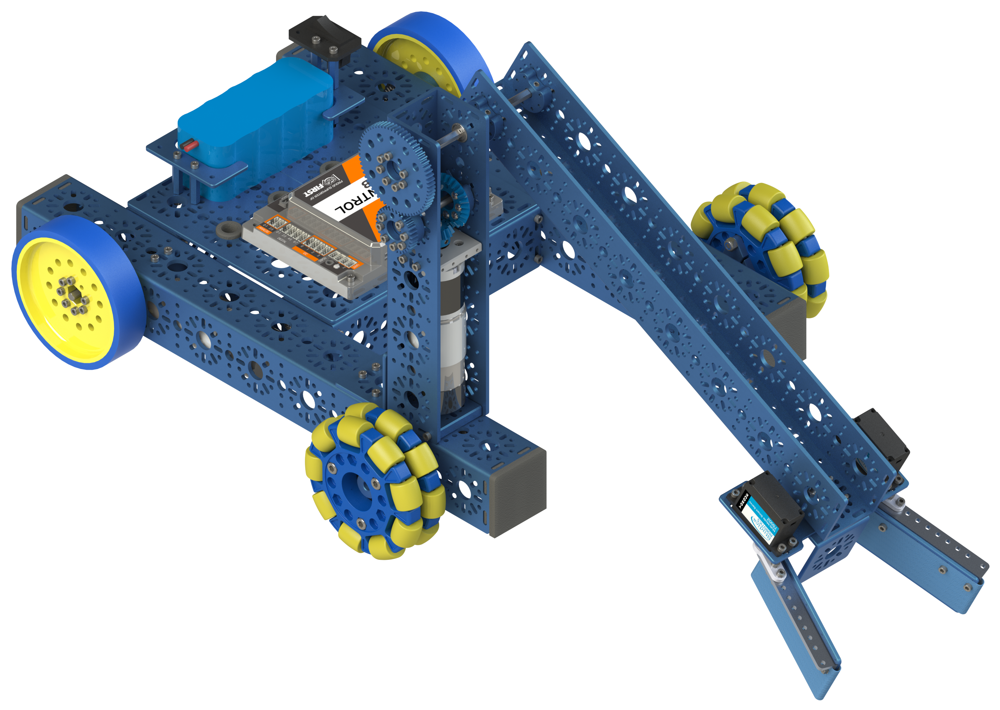

Basic Bot
=========

The basic bot is a simple robot that can built from the Studica Robotics FTC Starter Kit. The basic bot has two main parts, a chassis and an OMS (Object Management System). The chassis stays the same year after year however the OMS changes based on the years challenge. 

.. grid:: 3
    :gutter: 3
    :margin: 2

    .. grid-item-card:: 
        :link: Chassis/index
        :link-type: doc

        Chassis Build Guide
        ^^^

        .. figure:: images/Chassis-Basic-Bot.png
            :align: center
            :scale: 10%

    .. grid-item-card:: 
        :link: OMS/index
        :link-type: doc

        OMS Build Guide
        ^^^

        .. figure:: images/OMS.png 
            :align: center
            :scale: 10%

    .. grid-item-card:: 
        :link: Programming/index
        :link-type: doc

        Programming Guide
        ^^^

        .. figure:: images/Programming.png 
            :align: center
            :scale: 40%

