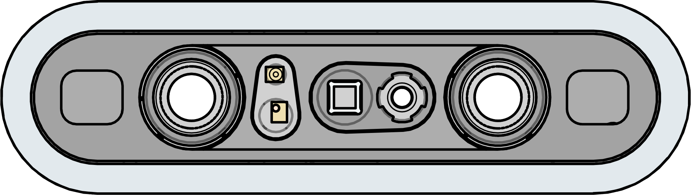
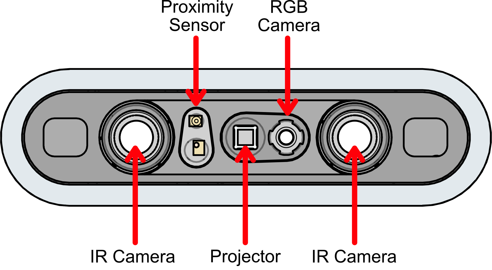

3D Depth Camera
===============

The 3D Depth Camera is designed to obtain depth images and colour images. This small camera will give the high performance required for accurate depth-sensing projects. When depth is unnecessary, a UVC RGB Camera is built in for easy use with any project. 

.. important:: The Laser on the 3D Depth Camera is class 1.

|

.. dropdown:: Camera Specifications (Click to Open)
    :animate: fade-in
    :color: info

    .. list-table:: Lidar Specs
        :widths: 30 40
        :header-rows: 1
        :align: center

        * - Item
          - Spec
        * - Technology
          - Active Stereo IR 
        * - Shutter Type
          - ID: Global Shutter, Color: Rolling Shutter
        * - Wavelength
          - 940nm  
        * - Range
          - 0.2-2.5m
        * - Precision
          - <1% @1m, 1.1% @2m(81%ROI)
        * - Power Consumption
          - Average <2.3W, Peak <5W
        * - Depth Resolution Framerate
          - 640x480 @30FPS, 1024x768 @30FPS
        * - Depth FOV
          - H79° V62°
        * - Image Format
          - Y11/Y12
        * - RGB Resolution Framerate
          - 640x480 @30FPS, 1280x720 @30FPS, 1920x1080 @30FPS
        * - RGB FOV
          - (16:9) H84.3° V53.6°, (4:3) H67° V53.6°
        * - Image Format
          - MJPEG, YUYV
        * - IR Resolution Framerate
          - 640x480 @30FPS, 1024x768 @10FPS
        * - Depth FOV
          - H79° V62°
        * - Image Format
          - Y10  
        * - Connection
          - USB 2.0 Type-C, Data + Power
        * - RGB Interface
          - UVC
        * - Operating Temperature
          - 10℃ ~ 40℃, 5%-95%RH(non-condensing)
        * - Anti-Flicker
          - 50Hz, 60Hz 
        * - Dimensions
          - 89.82mm x 25.10mm x 25.10mm
        * - Weight
          - 88.3g ±3g 
        * - Certifications
          - CE, FCC, RoHS 2.0, KC
            

Location of Sensors and Cameras
-------------------------------

|

Programming
-----------

Using ROS or ROS2:
^^^^^^^^^^^^^^^^^^

There is a driver that can be installed and used:

`ROS <https://github.com/orbbec/OrbbecSDK_ROS1>`__

`ROS2 <https://github.com/orbbec/OrbbecSDK_ROS2>`__

Using WPILib:
^^^^^^^^^^^^^

.. tabs::

    .. tab:: Java

        .. code-block:: java
            :linenos:

            import edu.wpi.cscore.UsbCamera;
            import edu.wpi.first.cameraserver.CameraServer;

            @Override
            public void robotInit()
            {
                new Thread(() -> {
                    UsbCamera camera = CameraServer.getInstance().startAutomaticCapture();
                    camera.setResolution(640, 480);
                }).start();
            }

    .. tab:: C++

        .. code-block:: c++
            :linenos:

            #include <cameraserver/CameraServer.h>

            static void VisionThead() 
            {
                cs::UsbCamera camera = frc::CameraServer::startAutomaticCapture();
                camera.SetResolution(640, 480);
            }

            void RobotInit() override 
            {
                std::thread visionThread(VisionThread);
                visionThread.detach();
            }

