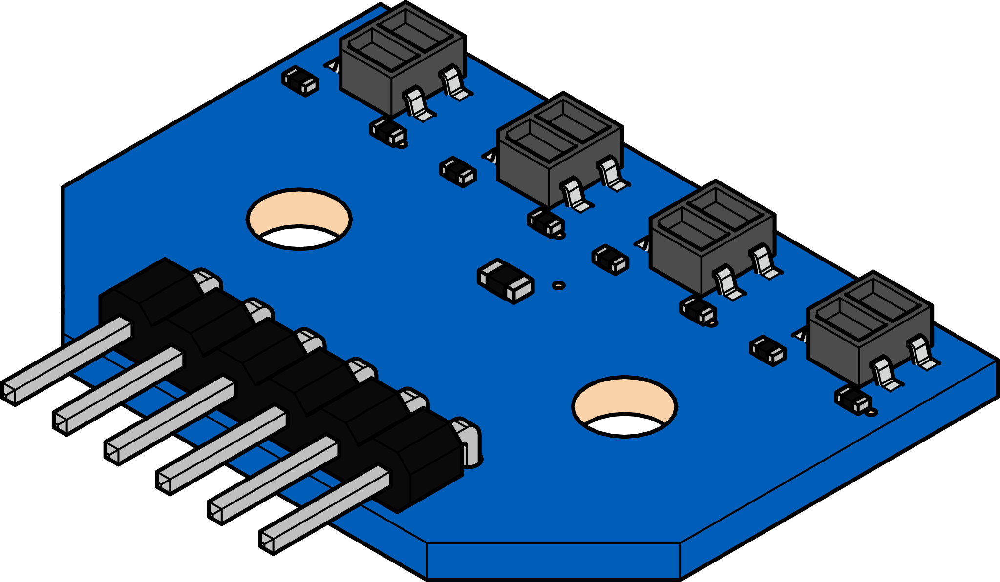
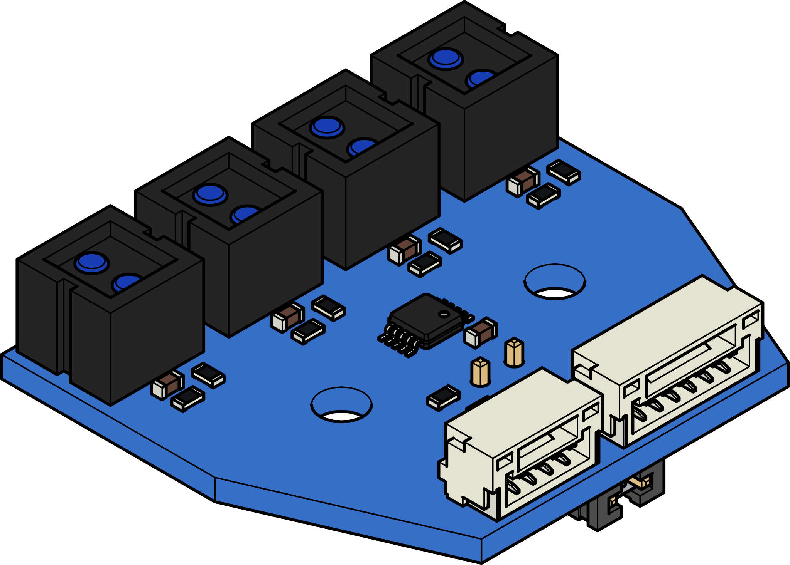

Cobra 
=====

The Cobra Line Follower provides an array of IR reflective sensors to be used for detecting a line. 

Cobra V2
--------

|

.. dropdown:: Cobra V2 Specifications (Click to Open)
    :animate: fade-in
    :color: info

    .. list-table:: Cobra V2 Specs
        :widths: 30 20 20 20
        :header-rows: 1
        :align: center

        * - Function
          - Min 
          - Typical
          - Max 
        * - Input Voltage
          - 3.3VDC 
          - 5VDC
          - ---
        * - Current
          - 25mA 
          - 70mA
          - 100mA 
        * - Sensing Distance
          - 1mm
          - 3mm
          - 5mm 

.. note:: The Cobra V2 requires the Analog Module to send data to the VMX. It is possible to place the inputs directly on the analog pins of the VMX. However, the analog module is recommended.

.. dropdown:: Analog Module
    :animate: fade-in
    :color: info

    .. figure:: images/ADC-Module.svg
                :align: center
                :width: 30%

Cobra V3
--------

The Cobra V3 has an upgraded IR sensor and the ADC has been added to the sensor. There are two outputs on V3, i2c and raw. The i2c connection, connects to the ADC and will return an accurate 12-bit value. Wheras, the raw outputs the raw analog output of the sensor. 

|

.. dropdown:: Cobra V3 Specifications
    :animate: fade-in
    :color: info

    .. list-table:: Cobra V3 Specs
        :widths: 30 20 20 20
        :header-rows: 1
        :align: center

        * - Function
          - Min 
          - Typical
          - Max 
        * - Input Voltage
          - 3.3VDC 
          - 5VDC
          - ---
        * - Current
          - 25mA 
          - 200mA
          - 250mA 
        * - Sensing Distance
          - 0mm
          - 5mm
          - 20mm 

Programming
-----------

Using WPILib:
^^^^^^^^^^^^^

.. tabs::

    .. tab:: Java

        .. code-block:: java
            :linenos:

            //import 
            import com.studica.frc.Cobra;

            //Cobra Library
            private Cobra cobra;

            //Custruct and instance
            cobra = new Cobra();

            //or if sensor is using 3.3V
            cobra = new Cobra(3.3F);

            //Grab data
            cobra.getVoltage(channel); // returns a float of the voltage
            cobra.getRawValue(channel); // returns a double

        The accessor methods will output either the votlage (0 - VIN) or the raw ADC value (0 - 2047).

    .. tab:: C++

        **Header**

        .. code-block:: c++
            :linenos:

            //Cobra Library
            #include "studica/Cobra.h"

            //Constructor 
            studica::Cobra cobra{};
            // or if sensor is using 3.3V
            studica::Cobra cobra{3.3F};

        **Source**

        .. code-block:: c++
            :linenos:

            // Call to access data
            cobra.GetVoltage(channel); // Gets the votlage at the specfified channel.
            cobra.GetRawValue(channel); // Gets the raw value from the ADC at the specified channel.

        The accessor functions will output either the voltage (0 - VIN) or the raw ADC value (0 - 2047).
