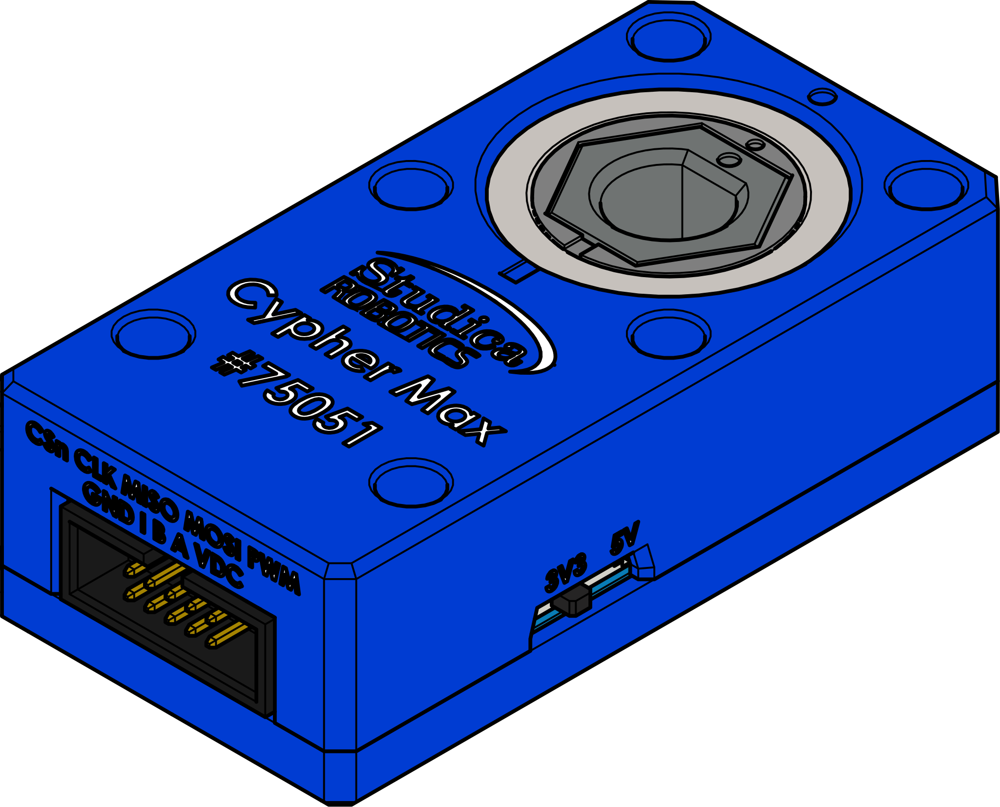

Encoders 
========

Encoders are a sensor placed normally on a shaft to provide feedback to a controller. This feedback allows for the detection of position, speed and direction of motion control system. There are two types of encoders absolute and incremental. Absolute encoders report back a location specific position and will remember the position through a power cycle. Incremental encoders only indicate that there has been a change in position and what that change was. In robotics both types of encoders are used. There are also advanced encoders that offer the function of both absolute and incremental. 

Studica offers both types of encoders. The Maverick motor has an incremental encoder attached to the back of the motor. There is also the Cypher Max which is an advanced encoder that offers absolute and incremental outputs. 

|            

.. dropdown:: Cypher Max Specs (Click to Open)
    :animate: fade-in
    :color: info

    .. list-table:: Cypher Max Specs
        :widths: 30 10
        :header-rows: 1
        :align: center

        * - Function
          - Value  
        * - Counts Per Revolution
          - 512
        * - Absolute Interface
          - PWM
        * - Incremental Interface
          - ABI
        * - Programming Interface
          - SPI
        * - Voltage
          - 3.3V or 5V 
        * - Temperature Range
          - -40℃ to 125℃
        * - Default Hub
          - 3/8" Hex

    Included with each Cypher Max:

    - PWM Cable
    - ABI Cable
    - FTC Control Hub Cable
    - Breakout Cable
    - 5mm Hex Insert
    - 6mm D-Shaft Insert
    - 7mm Hex Insert

    .. note:: With a CPR of 512 and a quadrature output the total pulses per revolution will be :bdg-danger-line:`2048`.

.. dropdown:: Maverick Encoder Specs
    :animate: fade-in
    :color: info

    .. list-table:: Maverick Encoder Specs
        :widths: 30 10
        :header-rows: 1
        :align: center

        * - Function
          - Value  
        * - Counts Per Revolution
          - 6
        * - Current
          - 6mA
        * - Voltage
          - 4V - 5V

    .. note:: With a CPR of 6, gear ratio of 61:1 and a quadrature output the total pulses per revolution will be :math:`\begin{equation}6*61*4 = 1464\end{equation}`.

Calculating Distance
--------------------

There are few formulas required to calculate distance traveled using incremental encoders. 

.. math::

    \begin{equation}
    {distancePerTick} =
    \frac{2 \pi r}{ticksPerRev * gearRatio}
    \end{equation}

Where:

- :bdg-danger-line:`r` = wheel or pulley radius.
- :bdg-danger-line:`ticksPerRev` = ammount of pulses of the encoder for one complete rotation.
- :bdg-danger-line:`gearRatio` = an external gear ratio used. Mostly will be 1:1 unless the encoder is not connected to output wheel or pulley directly. 

Example 
^^^^^^^

Let's look at an example using the Maverick and a 100mm omni wheel attached directly on the shaft of the motor. 

- :bdg-danger-line:`r` = 51mm (actual measured radius of omni wheel)
- :bdg-danger-line:`ticksPerRev` = 1464
- :bdg-danger-line:`gearRatio` = 1:1 (no external gearbox)

.. math::

    \begin{equation}
    {distancePerTick} = \frac{2 \pi r}{ticksPerRev * gearRatio}
    = \frac{2 \pi 51}{1464 * 1}
    = \frac{102 \pi}{1464}
    = 0.218881455mm
    \end{equation}

Therefor we can conclude that the distancePerTick for the Maverick using a 100mm omni wheel is **0.218881455mm**.

Application
^^^^^^^^^^^

The last formula needed is:

.. math::

    distance = {distancePerTick} * {encoderCount}

Where:

- :bdg-danger-line:`distancePerTick` = is calculated from the formula above.
- :bdg-danger-line:`encoderCount` = the incremental count from the encoder.

Let's look at a real work example.

**One Wheel Roation**

- :bdg-danger-line:`encoderCount` = 1464
- :bdg-danger-line:`distancePerTick` = 0.218881455mm

.. math::

    distance = {0.218881455} * {1464} = 320.44 mm

.. note:: The distance measured is in mm as the radius was specficed in mm.

With one wheel rotation there is a total travel of 320.4mm. 

**120 Wheel Rotations**

- :bdg-danger-line:`encoderCount` = 175680
- :bdg-danger-line:`distancePerTick` = 0.218881455mm

.. math::

    distance = {0.218881455} * {175680} = 38453.09401 mm

With 120 wheel roations there is a total travel of 38.45m. 

Code 
^^^^

Now that the math is known behind calculating distance with an incremental encoder. How can that be programmed. 

.. tabs::
   
    .. tab:: Java

        **Constants**

        .. code-block:: java
            :linenos:

            /**
             * Motor Constants
             */
            public static final int TITAN_ID                = 42; 
            public static final int MOTOR                   = 2;

            /**
             * Encoder Constants
             */

            //Radius of drive wheel in mm
            public static final int wheelRadius             = 51;

            //Encoder pulses per rotation of motor shaft    
            public static final int pulsePerRotation        = 1464;

            //Gear ratio between motor shaft and output shaft
            public static final double gearRatio            = 1/1;
           
            //Pulse per rotation combined with gear ratio
            public static final double encoderPulseRatio    = pulsePerRotation * gearRatio;

            //Distance per tick
            public static final double distancePerTick      = (Math.PI * 2 * wheelRadius) / encoderPulseRatio;
        
        **Subsystem**

        .. code-block:: java   
            :linenos:

            import com.studica.frc.TitanQuad;
            import com.studica.frc.TitanQuadEncoder;

            public class Subsystem
            {
                /**
                 * Motors
                 */
                private TitanQuad motor;

                /**
                 * Sensors
                 */
                private TitanQuadEncoder encoder;

                public Subsystem()
                {
                    //Motors
                    motor = new TitanQuad(Constants.TITAN_ID, Constants.MOTOR);

                    //Sensors
                    encoder = new TitanQuadEncoder(motor, Constants.MOTOR, Constants.distancePerTick);
                }

                /**
                 * Gets the distance traveled of the motor
                 * 

                 * @return the distance traveled
                 */
                public double getEncoderDistance()
                {
                    return encoder.getEncoderDistance();
                }
            }

    .. tab:: C++

        **Header**

        .. code-block:: c++
            :linenos:

            #include <studica/TitanQuad.h>
            #include <studica/TitanQuadEncoder.h>

            #include <cmath>

            class Subsystem : public frc2::SubsystemBase
            {
                public:
                    Subsystem();

                    double GetEncoderDistance (void);

                private:
                    /**
                     * Motor Constants
                     */
                    #define TITAN_ID                42
                    #define MOTOR_N                 2

                    /**
                     * Encoder Constants
                     */

                    //Radius of drive wheel in mm
                    #define wheelRadius             51

                    //Encoder pulses per rotation of motor shaft    
                    #define pulsePerRotation        1464

                    //Gear ratio between motor shaft and output shaft
                    #define gearRatio               1/1
                
                    //Pulse per rotation combined with gear ratio
                    #define encoderPulseRatio       pulsePerRotation * gearRatio

                    //Distance per tick
                    #define distancePerTick         (M_PI * 2 * wheelRadius) / encoderPulseRatio

                    /**
                     * Objects
                     */
                    studica::TitanQuad motor{TITAN_ID, MOTOR_N};
                    studica::TitanQuadEncoder encoder{motor, MOTOR_N, distancePerTick};
            };
    
        **Source**

        .. code-block:: c++
            :linenos:

            #include "subsystems/Subsystem.h"

            Subsystem::Subsystem(){};

            /**
             * Gets the distance traveled of the motor
             * 

             * @return the distance traveled
             */
            double Subsystem::GetEncoderDistance (void)
            {
                return encoder.GetEncoderDistance();
            }
