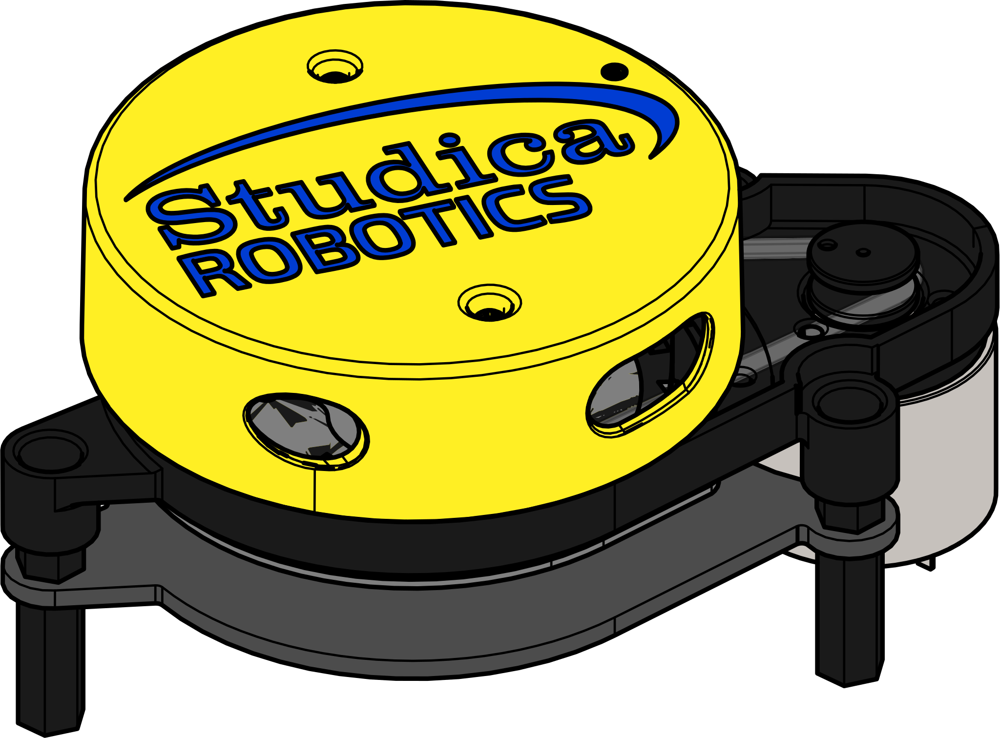
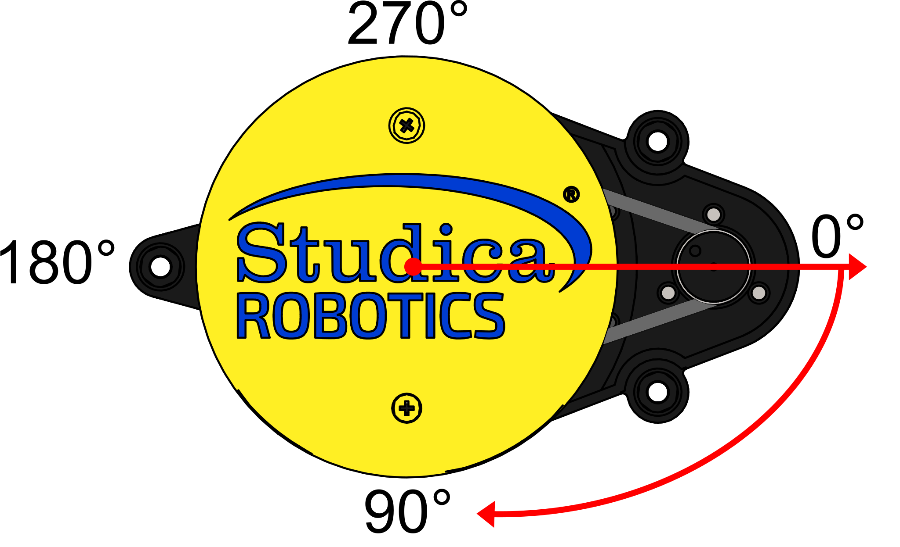

Lidar
=====

The Studica Lidar is a 360˚ 2D LiDAR. The lidar rotates 360˚ to continuosly output the angle and distance of a scanning environment. 

.. important:: The Laser on the lidar is class 1.

|

.. dropdown:: Lidar Specifications (Click to Open)
    :animate: fade-in
    :color: info

    .. list-table:: Lidar Specs
        :widths: 30 10 10 10 10 30
        :header-rows: 1
        :align: center

        * - Item
          - Min 
          - Typical
          - Max 
          - Unit 
          - Remark
        * - Ranging Frequency
          - /
          - 3000
          - /
          - Hz
          - Ranging 3000 times per second
        * - Motor Frequency
          - 5
          - 6
          - 8
          - Hz
          - Need to connect to PWM signal, recommended to use the speed of 6Hz
        * - Ranging Distance
          - 0.12
          - /
          - 8
          - m 
          - Indoor Environment with 80% reflectivity
        * - Field of View
          - /
          - 0-360
          - /
          - Deg
          - /
        * - Systematic Error
          - /
          - 2
          - /
          - cm 
          - Range ≤ 1m
        * - Relative Error
          - /
          - 3.5
          - /
          - %
          - 1m ≤ Range ≤ 6m
        * - Tilt angle
          - 0.25
          - 1
          - 1.75
          - Deg 
          - /
        * - Angle Resolution
          - 0.6 @ 5Hz
          - 0.72 @ 6Hz
          - 0.96 @ 8Hz
          - Deg
          - Different per motor Frequency
        * - Supply Voltage
          - 4.8
          - 5
          - 5.2
          - V
          - Excessive voltage might damage the lidar 
        * - Supply Current
          - 1000
          - /
          - /
          - mA
          - Instantaneous peak current at start-up
        * - Working Current
          - /
          - 300
          - 500
          - mA
          - Lidar when activly scanning
        * - Laser Wavelength
          - 775
          - 793
          - 800
          - nm
          - Infrared band
        * - Operating Temperature
          - 0
          - 20
          - 40
          - ℃
          - No condensation
        * - Storage Temperature
          - -10
          - /
          - 60
          - ℃
          - With package
        * - Lighting Environment
          - 0
          - 550
          - 2000
          - Lux
          - For reference only
        * - Weight
          - /
          - 126
          - /
          - g
          - N.W.

Polar Coordinate System Definition
----------------------------------

The lidar defines a polar coordinate system. The center of the rotating core is taken as the pole and the specified angle is positive clockwise. The zero angle is located directly in front of the motor. With tolerances there is a ±3˚ deviation. 

|

Programming
-----------

Using ROS or ROS2:
^^^^^^^^^^^^^^^^^^

There is a driver that can be installed and used:

`ROS <https://github.com/YDLIDAR/ydlidar_ros_driver>`__

`ROS2 <https://github.com/YDLIDAR/ydlidar_ros2_driver>`__

Using WPILib:
^^^^^^^^^^^^^

.. tabs::

    .. tab:: Java

        Full example can be viewed on the example github `here <https://github.com/studica/WorldSkills-Example-Projects/tree/main/Lidar%20Test%20Code/java>`__

        .. code-block:: java
            :linenos:

            //Lidar Library
            private Lidar lidar;

            //Lidar Scan Data Storage class
            private Lidar.ScanData scanData;

            /**
             * Top USB 2.0 port of VMX = kUSB1
             * Bottom USB 2.0 port of VMX = kUSB2
             */
            lidar = new Lidar(Lidar.Port.kUSB1); //Lidar will start spinning the moment this is called

            //Call that will start the lidar if stopped
            lidar.start();

            //Call that will stop the lidar if needed. 
            lidar.stop();

            //Call to get data from lidar.
            scanData = lidar.getData();

            //Output Lidar data at 60 degrees
            System.out.println("Angle: " + scanData.angle[60] +"˚, Distance: " + scanData.distance[60] + "mm");

    .. tab:: C++

        Full example can be viewed on the example github `here <https://github.com/studica/WorldSkills-Example-Projects/tree/main/Lidar%20Test%20Code/cpp>`__

        **Header**

        .. code-block:: c++
            :linenos:

            //Lidar Library
            #include "studica/Lidar.h"

            /**
             * kUSB1 = Top USB 2.0 port of VMX
             * kUSB2 = Bottom USB 2.0 port of VMX
             */ 
            studica::Lidar lidar{studica::Lidar::Port::kUSB1}; //Lidar will start spinning the moment this is called

            // Scan data struct
            studica::Lidar::ScanData scanData;

        **Source**

        .. code-block:: c++
            :linenos:

            //Call that will start the lidar if stopped
            lidar.Start();

            //Call that will stop the lidar if needed. 
            lidar.Stop();

            //Call to get data from lidar.
            scanData = lidar.GetData();

            //Output Lidar Data at 60 degrees
            cout << "Angle: " << scanData.Angle[60] << "˚, Distance: " << scanData.Distance[60] << "mm" << endl;
