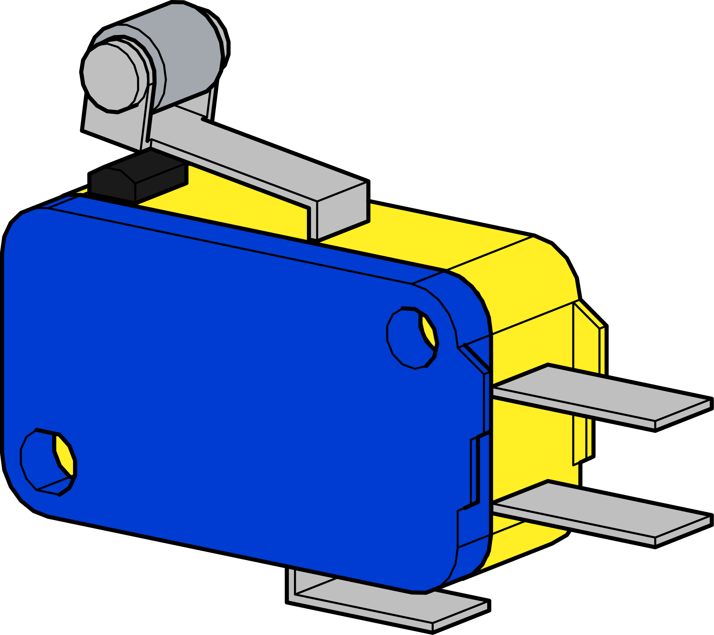
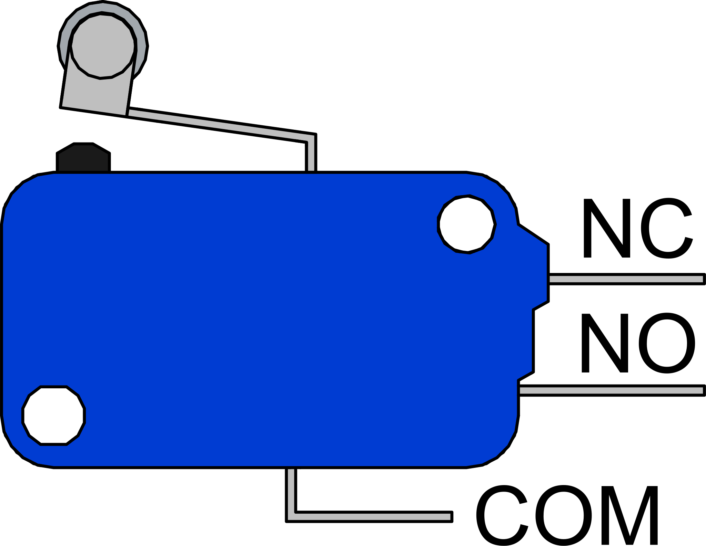

Limit Switches
==============

Limit switches have many uses on a robot or mechanism. 

|

Limit Switch Pinout
-------------------

|

The inputs on the VMX :bdg-danger-line:`FlexDIO` and Titan are pulled high, with the Titan having hardware debounce correction. When wiring the limit switch it is recommended to wire ground to :bdg-danger-line:`common` and signal to :bdg-danger-line:`normally open`. 

Limit Switch Configuration
--------------------------

The limit switch has three ways it can be configured for use. 

.. list-table:: 
    :widths: 30 30 30 
    :header-rows: 1
    :align: center

    * - Default
      - Forward 
      - No Roller
    * - .. figure:: images/Limit-Switch-Pos-1.svg
            :align: center
            :width: 80%
      - .. figure:: images/Limit-Switch-Pos-2.svg
            :align: center
            :width: 80%
      - .. figure:: images/Limit-Switch-Pos-3.svg
            :align: center
            :width: 80%

Programming
-----------

Limit Switches are read as a digital input. If wired correctly per the pinout section above, when a switch is activated it will show as :bdg-danger-line:`low` or :bdg-danger-line:`false`.

.. tabs::
   
    .. tab:: Java

        .. code-block:: java
            :linenos:

            //import the DigitalInput Library
            import com.wpi.first.wpilibj.DigitalInput;

            //Create the DigitalInput Object
            private DigitalInput input;

            //Constuct a new instance
            input = new DigitalInput(port);

            //Can then use these accssor to get data
            input.get(); //Will return true for a high signal and false for a low signal

    .. tab:: C++

        **Header**

        .. code-block:: c++
            :linenos:

            //Include the DigitalInput Library
            #include "frc/DigitalInput.h"

            //Constructors
            frc::DigitalInput input{port};

        **Source**

        .. code-block:: c++
            :linenos:

            //Use these to access data
            input.Get(); //Will return true for a high signal and false for a low signal