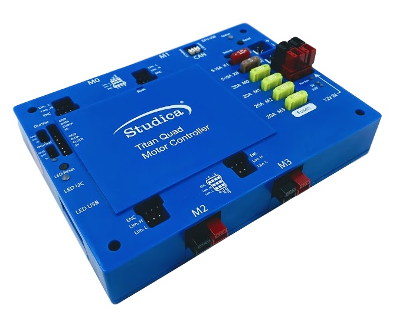

Titan
=====

The Titan Quad is a motor controller with four DC motor outputs that operate on the CAN Bus. Developed for WorldSkills but adapted for other uses.

|

.. grid:: 2
    :gutter: 3
    :margin: 2

    .. grid-item-card::
        :class-header: sd-bg-primary sd-text-white
        :link: programming-titan
        :link-type: doc

        Programming the Titan
        ^^^

        How to program the Titan Quad Motor Controller

    .. grid-item-card::
        :class-header: sd-bg-primary sd-text-white
        :link: update-and-config
        :link-type: doc

        Update and Configuration App
        ^^^

        Installing and Use of the Update and Config App

|        

.. dropdown:: Layout (Click to Open)
    :animate: fade-in
    :color: info

    .. figure:: images/titan-1.png
        :align: center
        :width: 50%

    |

    1. **Power input**. Input requires a 12VDC battery, and two ports are available connected in parallel. Both ports can be used for increasing the capacity or as a battery in, battery out.  
    2. **Power output**. Outputs 12VDC out to other devices such as, VMXpi or Servo Power Block. 
    3. **Voltage indicators**. There is a reverse power indicator (red) that will light up if the voltage is connected in reverse. The other two indicators display the voltage rails 5V and 3.3V.
    4. **Fusebox**. Before voltage can be applied to the motors or power outputs (2), an appropriate fuse must be inserted into the box. Motors take 20A fuses, and power outputs take 5 - 15A fuses.
    5. **RGB Status Light**.
    6. **DFU USB** - used to communicate with the computer for updates and configuration.
    7. **CAN-BUS Input** - High side (yellow) and Low side (green) inputs.
    8. **M1** - Motor 1 output.
    9. **M0** - Motor 0 output.
    10. **M3** - Motor 3 output.
    11. **M2** - Motor 2 output.
    12. **Boot** - used only when an error occurs, and Titan cannot communicate with the computer and needs a firmware upgrade. 
    13. **NeoPixel** - addressable LED output
    14. **DotStar** - addressable LED output
    15. **Pin 13/ L** for LED microcontroller
    16. **RX/TX** - LEDs for microcontroller
    17. **LED i2c** - com port for microcontroller
    18. **LED USB** - used to communicate with the computer for uploading code
    19. **Encoder port** - Quadrature encoder input
    20. **Limit H** - High limit switch input. (Limits are pulled high and use hardware debouncing)
    21. **Limit L** - Low limit switch input. (Limits are pulled high and use hardware debouncing)

.. dropdown:: Electrical Characteristics
    :animate: fade-in
    :color: warning

    .. list-table:: Electrical Characteristics
        :widths: 30 10 10 10
        :header-rows: 1
        :align: center
    
        *   - Function 
            - Min 
            - Nom 
            - Max 
        *   - Input Voltage
            - 10VDC
            - 12VDC
            - 14VDC
        *   - Output Voltage
            - 10VDC
            - 12VDC
            - 14VDC
        *   - Motor Output Amperage
            - 0A
            - ---
            - 20A
        *   - Motor Frequency
            - 0Hz
            - 15.6KHz
            - 20KHz
        *   - Encoder Voltage Output
            - 4.5V
            - 5V
            - 5.5V
        *   - Limit Switch Output
            - 4.5V
            - 5V
            - 5.5V
        *   - LED Voltage Output
            - 4.5V
            - 5V
            - 5.5V
        *   - LED Output Amperage
            - 0A
            - ---
            - 6A
        
.. dropdown:: Status Light
    :animate: fade-in
    :color: success

    Below are the various status light blink codes and the meaning behind them.

    .. list-table:: Status Light Blink Codes
        :widths: 50 25 25 25
        :header-rows: 1
        :align: center
        
        *   - Function
            - Blink 1
            - Blink 2
            - Blink 3
        *   - Titan Off / Update 
            - .. image:: images/titan-status-light-5.png
                :align: center
            - .. image:: images/titan-status-light-5.png
                :align: center
            - .. image:: images/titan-status-light-5.png
                :align: center
        *   - No Communication 
            - .. image:: images/titan-status-light-1.png
                :align: center
            - .. image:: images/titan-status-light-1.png
                :align: center
            - .. image:: images/titan-status-light-1.png
                :align: center
        *   - CAN Detected, Robot Disabled 
            - .. image:: images/titan-status-light-1.png
                :align: center
            - .. image:: images/titan-status-light-2.png
                :align: center
            - .. image:: images/titan-status-light-3.png 
                :align: center
        *   - CAN Detected, Robot Enabled 
            - .. image:: images/titan-status-light-4.png
                :align: center
            - .. image:: images/titan-status-light-4.png
                :align: center
            - .. image:: images/titan-status-light-4.png
                :align: center
        *   - Fault Detected  
            - .. image:: images/titan-status-light-6.png
                :align: center
            - .. image:: images/titan-status-light-6.png
                :align: center
            - .. image:: images/titan-status-light-6.png
                :align: center
        
    **Titan Off / Update**
    
    When the Titan is off, there will be no flashing light. The light will also be off if set to update mode.  If the Titan is on, not in update mode, and the light is off, there could be a problem with the microcontroller or the LED. 

    **No Communication**

    Is typically seen during bootup. When the Titan receives any CAN packet that is not blocked by the filter, the flashing blue will switch over to CAN Detected. If the light is still flashing blue when it should be in CAN Detected, either the CAN ID on the Titan is set incorrectly or the CAN ID set in the robot code is incorrect. 

    .. important:: If the CAN ID on the Titan is changed through the config app, the Titan needs to be rebooted for the configuration on the Titan to be set correctly. 

    **CAN Detected, Robot Disabled**

    The flashing lights of RED, GREEN, BLUE, resembles that the CAN bus is detected; however, the robot is disabled. To get out of this state, the robot must be enabled via the driver station. If the robot is enabled and the status light is still showing this state, there is no communication between the driver station and the VMXpi.

    **CAN Detected, Robot Enabled**

    The blinking purple displays that the robot is enabled and allows for the motors to be moved. 

    **Fault Detected**

    This state will occur if there is a fault error on one of the gates for driving the motors. This could be but not limited to: thermal shutdown, current overflow, voltage cutoff, and gate failure. 

.. toctree::
    :hidden:

    programming-titan
    update-and-config
    