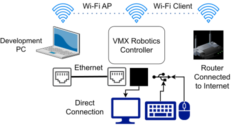
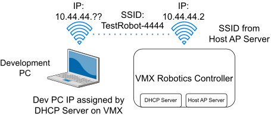
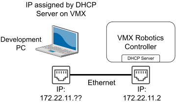
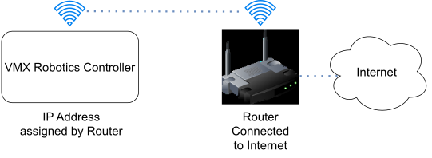
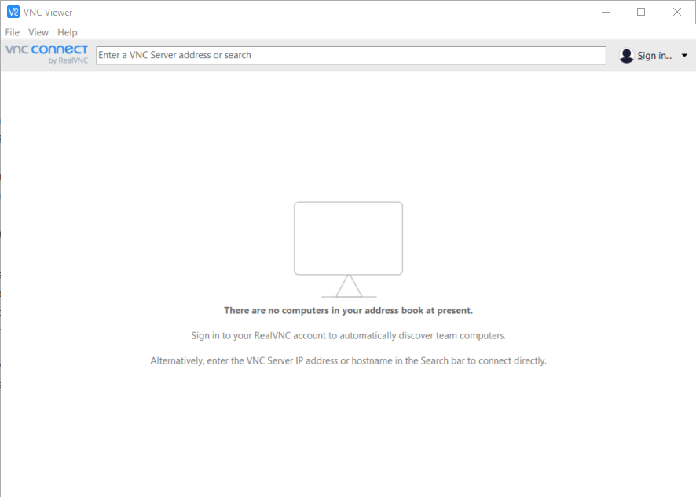
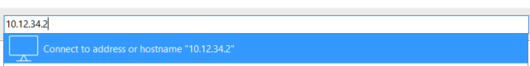
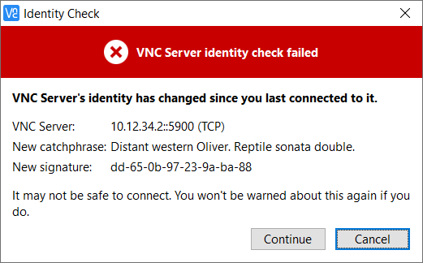
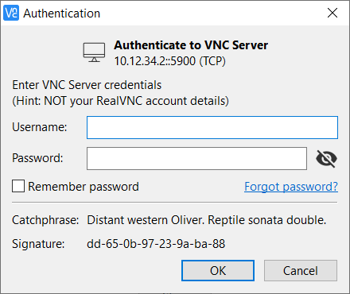
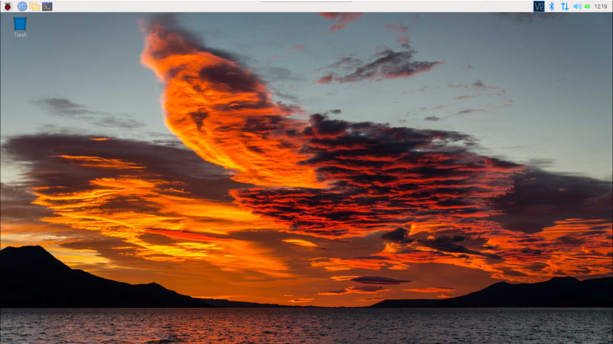

Networking
==========

.. important:: Out of the box, the VMX will emit a Wi-Fi with an SSID of ``VMX-1234`` and requires a password. The password is ``password``. Older versions of the VMX may ship with an SSID of ``WorldSkills-1234`` with a password of ``password``.

There are four main ways to communicate with the VMX. 

|

- Wi-Fi Access Point (AP)
- Wi-Fi Client (Access Internet)
- Ethernet (Prefered)
- Direct Desktop Connection

.. tip:: It is always recommended to be in Wi-Fi AP mode, and the preferred method of communicating with the VMX is Ethernet.

Wi-Fi Access Point (AP)
-----------------------

In Wi-Fi AP mode, the VMX will create its own Wi-Fi network that a user's computer can connect directly to. 

|

In Wi-Fi AP mode, the IP address of the VMX will be ``10.XX.YY.2``. XX.YY corresponds to a four-digit team number given by the user. Out of the box with the default image, the team number is set to 1234. With a team number of 1234, the IP address will be ``10.12.34.2``.

Changing the SSID Team number and password of the Wi-Fi AP is easily managed by a built-in script on the VMX.

.. code-block:: bash

    setupWifiAP.sh SSID TEAMNUMBER PASSWORD

Where:

- **SSID** is the prefix for the name of the Wi-Fi. Out of the box, this is ``VMX`` aka the VMX in VMX-1234. 
- **TEAMNUMBER** is the suffix for the name of the Wi-Fi. Out of the box, this is ``1234`` aka the 1234 in VMX-1234. 
- **PASSWORD** is an optional add-on that allows a password to be created for the Wi-Fi.

.. important: Passwords will be required if using the VMX at a WorldSkills competition.

Out of the box on the default image for the VMX, the Wi-Fi is set up as ``VMX-1234`` with a password of ``password``. When using the setup script, it would look like this:

.. code-block:: bash

    setupWifiAP.sh VMX 1234 password

If the user wanted to change the Wi-Fi to be something such as ``TestRobot-4444`` with a password of ``Checkers`` the user would run the command like this:

.. code-block:: bash

    setupWifiAP.sh TestRobot 4444 Checkers

After running the command, the network will now look like this:

|

When switching from Client mode to AP mode, the SSID, team number and password do not have to be changed. Only the script needs to be run with no extra parameters. 

.. code-block:: bash

    setupWifiAP.sh

Ethernet
--------

Ethernet mode is always active and hardcoded. This mode is recommended to be used at all times except when the robot completes a run. 

The hardcoded IP address of the VMX ethernet port is always ``172.22.11.2``.

|

Wi-Fi Client
------------

Wi-Fi Client mode turns the Wi-Fi AP off and will reconnect the VMX to any Wi-Fi-enabled router. This mode should be rarely used and only ever used for updating or downloading a new package for the VMX.

|

Run the following command in the terminal to put the VMX into Wi-Fi Client mode. 

.. code-block:: bash

    setupWifiClient.sh

.. important:: It is highly recommended to connect to the VMX via Ethernet, remote in, put the VMX into Client mode, do what needs to be done and then put the VMX back into AP mode using the commands from the AP section. 

Remote Desktop Connection
-------------------------

It can be challenging to bring a monitor, keyboard and mouse around all the time. A remote desktop connection solves this problem by allowing the user to remote into the VMX to accomplish tasks. Remote desktop connections are available when connecting to the VMX via AP, Client or Ethernet. Built into the VMX's default image is a VNC server. Using an application such as VNC Viewer, the user can remote in and see the desktop of the VMX. VNC Viewer can be downloaded `here <https://www.realvnc.com/en/connect/download/viewer/>`__.

With the VMX connected via an AP, Client, or Ethernet method, open VNC Viewer on your computer. A window like this should open up:

|

To create a connection to the VMX, the IP address of the VMX needs to be inserted. Remember from the AP and Ethernet sections that the IP address will be ``10.XX.YY.2`` (with XX.XX being your 4-digit team number) in AP mode or ``172.22.11.2`` when connected via Ethernet. If the VMX is in Client mode and not connected via Ethernet, the IP address must be obtained from the router admin portal of the Wi-Fi the VMX is connected to. 

|

The first time you connect to the VMX from a computer, there will be an identity check error. Hit continue, and a login screen will open. 

|

When the login screen opens, it will ask for a username and password. For the default out of the box VMX image, this will be: 

- **Username:** ``pi`` 
- **Password:** ``raspberry``

|

Once logged in, the desktop of the VMX should now be accessible. 

