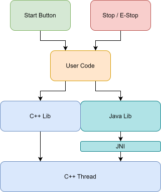

MockDS
======

MockDS is a simple internal UDP packet loop that WPILib created for use on the test bench. We have modified its original code for use with the VMX. 

MockDS Overview
----------------

|

MockDS' lowest level is a C++ real-time thread that runs in the background with the user code. The thread runs a specific UDP message in a loop that will either enable or disable the robot in autonomous mode. Depending on the user code project type, the thread is accessed by either the Studica C++ Lib or the Studica Java Lib. 

While a specific user hardware interface, such as a button, is not required, it is recommended. The start button is good for enabling the robot, while the e-stop is good for disabling the robot. The e-stop is preferred as it is latching.

With the layout of MockDS, if the user code gets bogged down or stuck, the robot will stay enabled. **This can be potentially dangerous as there will be no way to disable the robot if this happens.**

Adding MockDS
-------------

MockDS can be added to the robot code by first upgrading the Studica.json to version :bdg-danger-line:`1.1.26` or higher. 

To upgrade:

1) Open the Command Pallete in VSCode.
2) Select: WPILib: Manage Vendor Libraries
3) Select: Check for updates (online)
4) Select: Studica.json 
5) Hit yes to build and cache the new library. 

MockDS Code
-----------

    .. tabs::

        .. tab:: Java

            .. code-block:: java
                :linenos:

                // Import the MockDS Library
                import com.studica.frc.MockDS;

                public class Robot extends TimedRobot
                {

                    private MockDS ds; // Create the object
                    private boolean active = false; // active flag prevents calling mockds more than once.

                    @Override
                    public void robotInit()
                    {
                        ds = new MockDS(); // Create the instance
                    }

                    @Override
                    public void robotPeriodic()
                    {
                        // If the start button is pushed and the system is not active 
                        if (!RobotContainer.driveTrain.getStartButton() && !active)
                        {
                            ds.enable(); // enable the robot.
                            active = true;
                        }
                        // If the e-stop is pushed and the system is active
                        if (!RobotContainer.driveTrain.getEStopButton() && active)
                        {
                            ds.disable(); // disable the robot.
                            active = false;
                        }
                    }
                }

        .. tab:: C++

            **Header**

            .. code-block:: c++
                :linenos:

                #prama once

                // Include the MockDS Library
                #include "studica/MockDS.h"

                class Robot : public frc::TimedRobot
                {
                    private:
                        studica::MockDS ds; // Create the object and the instance
                        bool active; // Active flag prevents calling mockds more than once
                };

            **Source**

            .. code-block:: c++
                :linenos:

                #include "Robot.h"

                void Robot::RobotInit()
                {
                    active = false; // System should be default disabled
                }

                void Robot::RobotPeriodic()
                {
                    // If the start button is pushed and the system is not active 
                    if (!m_container.drive.GetStartButton() && !active)
                    {
                        ds.Enable(); // enable the robot
                        active = true;
                    }
                    // If the e-stop is pushed and the system is active
                    if (!m_container.drive.GetEStopButton() && active)
                    {
                        active = false;
                        ds.Disable(); // disable the robot
                    }
                }
