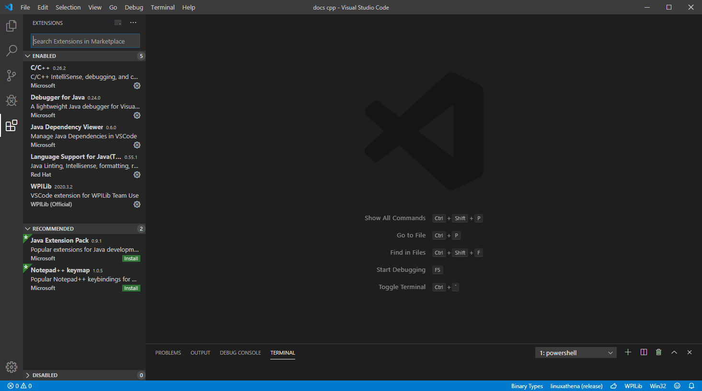
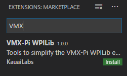
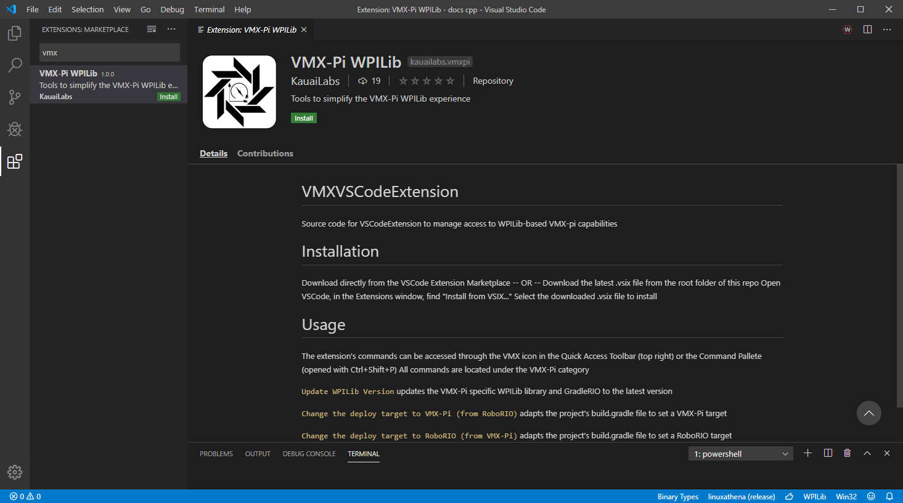
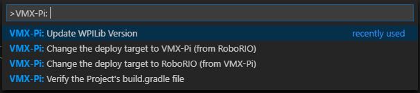
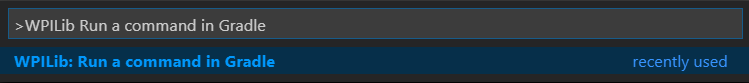
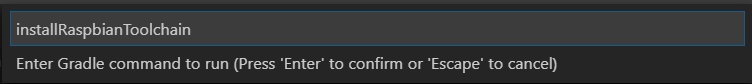

Setting up VS Code for the VMX
==============================

By default the VS Code that was just installed in software setup is configured for a **roboRIO**. There are some simple steps required to change that configuration to a **VMX**. 

VMX VS Code Extension
---------------------

The VMX VS Code extension will convert the ``build.gradle`` for the roboRIO into a ``build.gradle`` for the VMX. The extension will also allow you to update the GradleRIO version for the VMX, when a new version is available. 

Installing the Extension
^^^^^^^^^^^^^^^^^^^^^^^^

To install the extension head over to the Extensions tab on the left panel of VS Code or hit ``Ctrl + Shift + X``.

|

In the search bar, search for ``VMX``.

|

Select the extension ``VMX-PI WPILib``.

|

Click on ``Install`` to install the extension.

The installation will be successful when the white VMXpi logo pops up next to the WPILib logo.

|

Using the Extension
^^^^^^^^^^^^^^^^^^^

There are four commands in the extension palette.

|

- ``Update WPILib Version`` will update to the current **GradleRIO** version for the VMX. Ensure that the project is already set to a VMX project and not a roboRIO project before running this command. 
- ``Change the deploy target to VMX-Pi (from RoboRIO)`` will update the ``build.gradle`` file to use the VMX as a target.
- ``Change the deploy target to RoboRIO (from VMX-Pi)`` will update the ``build.gradle`` file to use the roboRIO as a target.
- ``Verify the Project's build.gradle file`` checks if everything is good to go with ``build.gradle``.

After creating a new WPILib project which will default as a roboRIO target. The command ``Change the deploy target to VMX-Pi (from RoboRIO)`` needs to be run. In turn the command will grab and cache the appropriate GradleRIO for the project. 

Installing the Raspbian Toolchain (C++ only)
^^^^^^^^^^^^^^^^^^^^^^^^^^^^^^^^^^^^^^^^^^^^

Anyone using C++ for WPILib requires the Raspbian toolchain for building and reploying to the VMX. 

Open the WPILib extension and use the command ``Run a command in Gradle``.

            
|

In the popup window type ``installRaspbianToolchain`` and hit enter. The toolchain will now be installed and cached to the computer.

